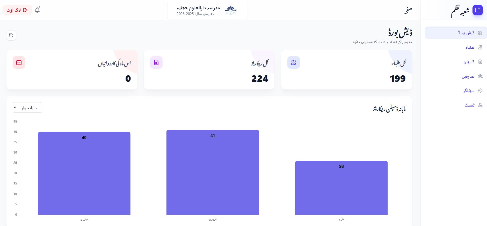

<p align="center">
  
</p>

<h1 align="center">شعبہ نظم — Shoba Nazam v2</h1>

<p align="center">
  <strong>Madrasa Discipline & Student Management System</strong>
</p>

<p align="center">
  A modern, full-stack web application built to digitize and streamline the discipline management workflow of Islamic educational institutions (Madaris). Designed with a clean RTL-first Urdu interface, role-based access control, and real-time analytics.
</p>

<p align="center">
  
  
  
  
  
  
</p>

---

## 📸 Dashboard Preview

<p align="center">
  
</p>

---

## 📋 Table of Contents

- [Overview](#-overview)
- [Key Features](#-key-features)
- [Tech Stack](#-tech-stack)
- [Database Schema](#-database-schema)
- [Getting Started](#-getting-started)
- [Contributing](#-contributing)
- [License](#-license)

---

## 🎯 Overview

**Shoba Nazam** (شعبہ نظم — lit. "Department of Discipline") is a purpose-built management system for Madaris (Islamic seminaries) to:

- **Digitize** student enrollment and record-keeping
- **Track** discipline incidents with categorized incident types
- **Analyze** behavioral trends through interactive charts and dashboards
- **Manage** multiple staff users with granular role-based access
- **Support** multi-tenancy — each Madrasa operates in its own isolated data environment

The application features a fully **RTL (Right-to-Left) Urdu interface**, making it culturally and linguistically appropriate for its target audience across South Asia.

---

## ✨ Key Features

### 🏫 Multi-Tenant Architecture
- Complete data isolation per Madrasa via a custom `BelongsToMadrasa` trait
- Automatic global query scoping — every query is filtered by the authenticated user's Madrasa
- Auto-assignment of `madrasa_id` on record creation

### 📊 Interactive Dashboard
- **Total Students** — real-time count of enrolled students
- **Total Discipline Records** — cumulative incident count
- **Monthly Activity** — current month's incident tally
- **Dynamic Charts** — toggle between monthly trends and class-wise breakdowns using Chart.js
- Urdu month names (جنوری، فروری، مارچ…) for native readability

### 👨‍🎓 Student Management
- Full CRUD operations with paginated listings
- Search by student name, father's name, or unique code
- Unique student code enforcement per Madrasa
- Fields: Student Name (`sname`), Father's Name (`fathername`), Code, Class

### 📝 Discipline Records
- Log incidents against students with categorized incident types
- Advanced filtering: by student, incident type, date range, and class
- Eager-loaded relationships for optimized API responses
- Detailed incident notes with date tracking

### 🏷️ Incident Type Management
- Customizable incident categories per Madrasa (e.g., Late Arrival, Absent, Homework Missing)
- Duplicate-name prevention within each institution
- Default types seeded on setup: `Late Arrival`, `Absent`, `Discipline Conflict`, `Homework Missing`, `Excellent Performance`

### 👥 User Management (Admin Only)
- Create, update, and delete staff accounts
- Assign and sync roles via Spatie Permission
- Toggle user active/inactive status
- Protected admin-only routes

### 🔐 Authentication & Security
- Token-based authentication via **Laravel Sanctum**
- Form request validation with dedicated request classes
- Role-based route protection (admin, nazim, masool e nazam)
- Middleware-enforced Madrasa assignment checks

### ⚙️ Madrasa Settings
- Customize institution name, logo, contact details
- Configure academic year and primary brand color
- Logo upload with old-file cleanup via Laravel Storage

### 🧾 Audit Logging
- Track all data mutations (create, update, delete)
- Store changed fields as JSON for complete change history
- User and Madrasa scoped audit trail

### 🎨 Modern UI/UX
- RTL-first layout with full Urdu localization
- Glassmorphic header with backdrop blur
- Smooth page transitions with Vue Router
- Responsive sidebar navigation with active-state indicators
- SweetAlert2 for elegant confirmations and notifications
- Flatpickr for date selection
- Reusable component library (modals, popovers, buttons, loaders, empty states)

---

## 🛠️ Tech Stack

### Backend

| Technology | Version | Purpose |
|---|---|---|
| **PHP** | 8.2+ | Server-side runtime |
| **Laravel** | 12.x | MVC Framework |
| **Laravel Sanctum** | 4.x | API token authentication |
| **Spatie Permission** | 6.x | Role & permission management |
| **MySQL** | 8.x | Relational database |

### Frontend

| Technology | Version | Purpose |
|---|---|---|
| **Vue.js** | 3.5 | Reactive SPA framework |
| **Vue Router** | 5.x | Client-side routing |
| **Pinia** | 3.x | State management |
| **Tailwind CSS** | 4.x | Utility-first styling |
| **Vite** | 7.x | Build tooling & HMR |
| **Chart.js** | 4.x | Data visualization |
| **SweetAlert2** | 11.x | Alert & confirmation dialogs |
| **Flatpickr** | 4.x | Date/time picker |
| **Vue Multiselect** | 3.x | Advanced dropdown components |
| **Axios** | 1.x | HTTP client |

### DevOps & Tooling

| Tool | Purpose |
|---|---|
| **Concurrently** | Parallel dev server execution |
| **Laravel Pail** | Real-time log tailing |
| **Laravel Pint** | Code style formatting |
| **PHPUnit** | Backend testing |
| **Sass** | CSS preprocessing |

---

## 🗄️ Database Schema

### Entity Relationship Diagram

```
┌──────────────┐       ┌──────────────────┐       ┌───────────────────┐
│   madrasas   │       │      users       │       │     students      │
├──────────────┤       ├──────────────────┤       ├───────────────────┤
│ id (PK)      │◄──┐   │ id (PK)          │       │ id (PK)           │
│ name         │   ├───│ madrasa_id (FK)  │   ┌───│ madrasa_id (FK)   │
│ logo         │   │   │ name             │   │   │ sname             │
│ address      │   │   │ email (unique)   │   │   │ fathername        │
│ phone        │   │   │ password         │   │   │ code              │
│ email        │   │   │ is_active        │   │   │ class             │
│ primary_color│   │   │ timestamps       │   │   │ timestamps        │
│ academic_year│   │   └──────────────────┘   │   └─────────┬─────────┘
│ timestamps   │   │                          │             │
└──────────────┘   │   ┌──────────────────┐   │             │
                   │   │  incident_types  │   │             │
                   │   ├──────────────────┤   │             │
                   ├───│ madrasa_id (FK)  │   │             │
                   │   │ id (PK)          │   │             │
                   │   │ name             │   │             │
                   │   │ timestamps       │   │             │
                   │   └────────┬─────────┘   │             │
                   │            │             │             │
                   │   ┌────────▼─────────────▼─────────────▼──┐
                   │   │       discipline_records              │
                   │   ├───────────────────────────────────────┤
                   ├───│ madrasa_id (FK)                       │
                       │ id (PK)                               │
                       │ student_id (FK) ──────────────────────┘
                       │ incident_type_id (FK) ────────────────┘
                       │ detail (text, nullable)               │
                       │ date                                  │
                       │ timestamps                            │
                       └───────────────────────────────────────┘

                   ┌───────────────────────────────────────┐
                   │            audit_logs                  │
                   ├───────────────────────────────────────┤
                   │ id (PK)                               │
                   │ madrasa_id (FK)                       │
                   │ user_id (FK)                          │
                   │ action (created/updated/deleted)      │
                   │ model_type                            │
                   │ model_id                              │
                   │ changes (JSON)                        │
                   │ timestamps                            │
                   └───────────────────────────────────────┘
```

### Key Constraints

| Constraint | Description |
|---|---|
| `students.madrasa_id + code` | Unique composite — no duplicate student codes within a Madrasa |
| `users.email` | Globally unique across all Madrasas |
| `discipline_records` → `students`, `incident_types`, `madrasas` | Cascade delete on parent removal |
| `users` → `madrasas` | Set null on Madrasa deletion |

---

## 🚀 Getting Started

### Prerequisites

| Requirement | Version |
|---|---|
| PHP | ≥ 8.2 |
| Composer | Latest |
| Node.js | ≥ 18 |
| MySQL | ≥ 8.0 |

### Installation

**1. Clone the repository**

```bash
git clone https://github.com/Imtiaz-Ali17314/Shoba-Nazam-v2.git
cd Shoba-Nazam-v2
```

**2. Install dependencies**

```bash
composer install
npm install
```

**3. Configure environment**

```bash
cp .env.example .env
php artisan key:generate
```

Edit `.env` with your database credentials:

```env
DB_CONNECTION=mysql
DB_HOST=127.0.0.1
DB_PORT=3306
DB_DATABASE=shobanazam
DB_USERNAME=root
DB_PASSWORD=your_password
```

**4. Run database migrations**

```bash
php artisan migrate
```

**5. Seed demo data** *(optional)*

```bash
php artisan db:seed
```

> This creates **5 Madrasas**, each with an admin user, 5 staff members, 200 students, and randomized discipline records.

**6. Link storage** *(for logo uploads)*

```bash
php artisan storage:link
```

**7. Start the development server**

```bash
# Option A: Run all services concurrently (recommended)
composer dev

# Option B: Run separately
php artisan serve        # Backend  → http://localhost:8000
npm run dev              # Frontend → Vite HMR
```

**8. Access the application**

Navigate to `http://localhost:8000` in your browser.

- **First visit:** You will be redirected to the **Setup** page to create your Madrasa and admin account.
- **Subsequent visits:** Login with your credentials.

> **Demo Login** (after seeding): `admin1@madrasa.com` / `password`

---

## 🤝 Contributing

Contributions are welcome! Please follow these steps:

1. **Fork** the repository
2. **Create** a feature branch (`git checkout -b feature/your-feature`)
3. **Commit** your changes (`git commit -m 'Add new feature'`)
4. **Push** to the branch (`git push origin feature/your-feature`)
5. **Open** a Pull Request

### Code Style

- **PHP:** Enforced via [Laravel Pint](https://laravel.com/docs/pint)
- **JavaScript/Vue:** Follow Vue 3 Composition API conventions

---

## 📄 License

This project is open-sourced under the [MIT License](https://opensource.org/licenses/MIT).

---

<p align="center">
  <sub>Built with ❤️ for the Madaris community</sub>
</p>
